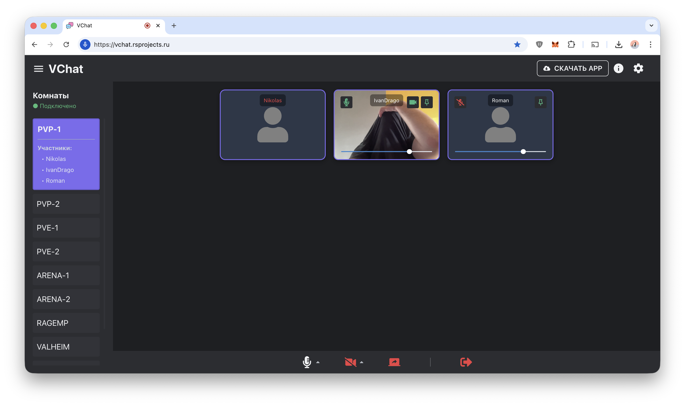
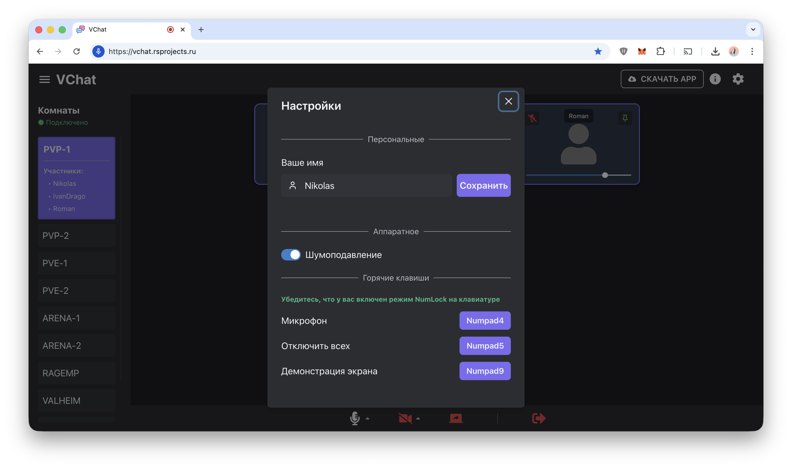
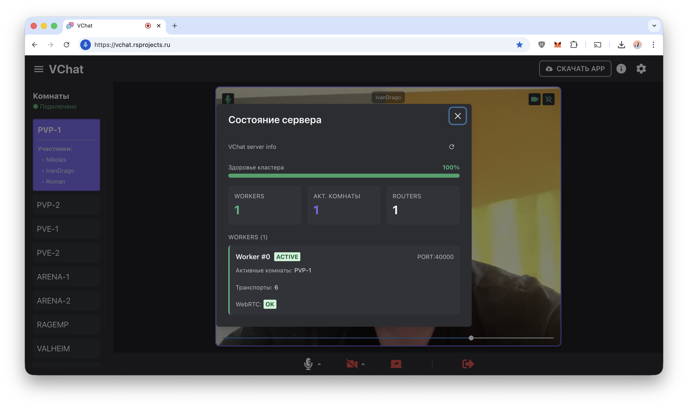

# VChat - Simple WebRTC Video Chat

Простой видеочат типа Discord «на минималках».

По сути весь репозиторий - это
**ReactJS** проект, но обратите внимание на директорию **`server/`**

- Здесь расположен небольшой **Backend Server**, который отвечает за
  сигнализацию между участниками;
- А также **сервер Mediasoup**, через который передаются медиапотоки.

Обмен медиа потоками реализован не по схеме *MESH*, а через **SFU**, чтобы
снизить нагрузку на трафик и избежать создания
`mesh-сети` между всеми участниками конференции.

<p align="center">
  <a href="docs/1.png" target="_blank">
    
  </a>
  <a href="docs/2.png" target="_blank">
    
  </a>
  <a href="docs/3.png" target="_blank">
    
  </a>
</p>
------------------------------------------------------------------------

## 🚀 Как запустить

### 1. Подготовьте конфигурацию

``` bash
cp .env.example .env
```

Отредактируйте файл под свои нужды.

------------------------------------------------------------------------

### 2. Соберите фронтенд

``` bash
docker compose run --rm npm ci
```

``` bash
docker compose run --rm npm run build
```

------------------------------------------------------------------------

### 3. Соберите и запустите весь стек

``` bash
docker compose build && docker compose up -d
```

------------------------------------------------------------------------

## 🔐 SSL-сертификат

### Получить сертификат

``` bash
docker compose run --rm certbot certonly --webroot --webroot-path /var/www/certbot/ -d <ВАШ_ДОМЕН>
```

Удобнее сначала использовать `dev.default.conf`, а после успешной
генерации сертификатов переключиться на `prod.default.conf`.

------------------------------------------------------------------------

### Обновить сертификат

``` bash
docker compose run --rm certbot renew
```

------------------------------------------------------------------------

## 🐳 Примечание

Команда:

``` bash
systemctl enable docker
```

Скорее всего, вам не пригодится - но пусть будет тут на всякий случай
🙂

------------------------------------------------------------------------

# ⚠️ Важно

Этот проект был написан **ради интереса под пивас**.\
Я ничего не обещаю, не гарантирую и **не собираюсь это поддерживать...**

**Да поможет вам Бог 🙂**
